# 🏝️ Isla Cañas Eco Hostel Business Plan

## Executive Summary

**Project**: Sustainable beachfront hostel in Isla Cañas Wildlife Refuge, Panama
**Location**: 1 hectare beachfront property, Isla Cañas, Los Santos Province
**Total Investment**: $57,000 USD
**Concept**: Dual-tier eco-friendly accommodation with turtle conservation focus

### Investment Breakdown
- **Land Purchase**: $30,000
- **Construction & Development**: $20,000
- **Legal & Permits**: $7,000
- **TOTAL INVESTMENT**: **$57,000**

### Key Financial Highlights
- **Year 1 Revenue**: $82,804
- **Year 1 Net Profit**: $29,804
- **ROI**: 52.3% annually
- **Payback Period**: 23 months

### Accommodation Strategy
- **Premium Tier**: 4 private bamboo bungalows ($25-50/night)
- **Budget Tier**: 12-station hammock area ($8-18/night)
- **Total Capacity**: 28 guests (16 in bungalows, 12 in hammocks)

---

## 🎯 Market Analysis & Positioning

### Target Market
- **Primary**: Eco-conscious backpackers and budget travelers (ages 20-35)
- **Secondary**: Turtle conservation volunteers and marine biology students
- **Tertiary**: Surf enthusiasts visiting nearby Playa Venao
- **Seasonal**: International turtle watching tourists (July-November peak)

### Unique Value Proposition
- Only beachfront eco accommodation directly in Isla Cañas turtle sanctuary
- Authentic community-based tourism experience
- Educational turtle conservation programs
- Gateway to Azuero Peninsula cultural experiences

### Market Opportunities
**🐢 Unique Eco Activities:**
- **Sea Turtle Nesting** (July-November): One of the most important Pacific nesting sites for 5 turtle species
- **Mangrove Kayaking/SUP Tours**: Extensive mangrove ecosystems
- **Whale Watching**: Seasonal opportunities
- **Marine Conservation**: Volunteer opportunities for turtle protection

**🏄 Adventure Activities:**
- **Surfing**: Close to renowned Playa Venao surf spots
- **Fishing**: Deep sea and coastal fishing
- **Diving & Snorkeling**: Rich marine biodiversity
- **ATV Tours & Horseback Riding**

**🎭 Cultural Immersion:**
- **Azuero Peninsula**: Known as Panama's cultural heart
- **Traditional Festivals**: Vibrant folklore and music
- **Artisan Crafts**: Local polleras, pintao hats
- **Community Tourism**: Authentic cultural experiences

---

## 🏗️ Facility Design & Development

### Development Phases

### Phase 1 Development ($20,000 Budget)

| Item | Cost (USD) | Details |
|------|------------|---------|
| **Common Area Building** | $5,000 | 40m² bamboo/wood structure with reception, lounge, library |
| **4 Bungalows** | $8,000 | 16m² each, bamboo construction, shared bathroom facilities |
| **Hammock Area** | $1,500 | Covered structure with 12 hammock stations and lockers |
| **Shared Outdoor Kitchen** | $2,000 | Covered area with gas stoves, prep space, storage |
| **Basic Utilities** | $2,000 | Well water, septic system, basic electrical |
| **Site Preparation** | $1,000 | Land clearing, basic paths, waste management setup |
| **Contingency** | $500 | Unexpected costs |
| **TOTAL** | **$20,000** | |

### Accommodation Specifications

#### Bungalow Specifications
- **Size**: 4m x 4m (16m²) each
- **Capacity**: 2-4 guests per bungalow (12-16 total capacity)
- **Materials**: Local bamboo, palm thatch roofing, concrete foundations
- **Features**: Queen bed, optional single bed/hammock, mosquito nets, fans, basic furniture, private entrance

#### Hammock Area Specifications
- **Size**: 6m x 8m (48m²) covered open-air structure
- **Capacity**: 12 hammock stations (12 guests total)
- **Materials**: Bamboo frame, palm thatch roof, raised wooden floor
- **Features**: Individual hammocks with mosquito nets, secure lockers, communal seating, ocean views

---

## 🌱 Essential Eco Features

### Cost-Saving Eco Implementation
**💰 Immediate Implementation (Phase 1):**
1. **Composting Toilets** ($800) - Eliminates sewage costs, creates fertilizer
2. **Greywater System** ($600) - Recycles shower/sink water for gardens
3. **Natural Ventilation** ($0) - Strategic building orientation reduces cooling needs
4. **Local Materials** ($0 extra) - Bamboo and palm reduce transport costs
5. **Organic Waste Composting** ($200) - Reduces waste disposal fees

**🔄 Phase 2 Additions (Year 2):**
- Solar panel system ($3,000) - Reduces electricity costs by 70%
- Rainwater collection ($2,000) - Reduces water costs
- Expanded gardens ($1,000) - Fresh produce for kitchen

---

## 📋 Legal Requirements & Permits

### Key Regulatory Bodies
- **ATP (Autoridad de Turismo de Panamá)** - Tourism Authority
- **Ministry of Environment (MiAmbiente)** - Environmental permits
- **Municipal Government (Los Santos Province)** - Local permits
- **Public Registry** - Business registration

### Required Permits & Licenses ($7,000 Total)

| **Legal & Permit Category** | **Cost (USD)** | **Timeline** |
|------------------------------|----------------|--------------|
| **Business Registration** | $2,000 | 30-45 days |
| - Panamanian Corporation (S.A.) | $1,500-2,000 | |
| - Tax Registration (RUC) | $50 | |
| - Municipal Business License | $200-500 | |
| **Tourism Permits** | $800 | 60-90 days |
| - ATP Tourism Business Registration | $300-500 | |
| - Public Accommodation Registry | $200 | |
| **Construction Permits** | $2,000 | 45-60 days |
| - Municipal Construction Permit | $500-1,000 | |
| - Environmental Impact Assessment | $1,000-3,000 | |
| **Operational Permits** | $650 | 30 days |
| - Health Department Permit | $200 | |
| - Fire Department Approval | $150 | |
| - Water & Sewage Permits | $300 | |
| **Legal/Professional Fees** | $1,500 | Throughout |
| **TOTAL LEGAL COSTS** | **$6,950** | **4-6 months** |

### Key Legal Considerations
**🌿 Environmental Compliance:**
- **Isla Cañas Wildlife Refuge Status**: Special environmental protections
- **Coastal Zone Regulations**: Setback requirements from high tide line
- **Turtle Nesting Protection**: Seasonal lighting restrictions (July-November)
- **Low Impact Construction**: Preferred status for eco-friendly materials

**📋 Tourism Compliance:**
- **ATP Registration**: Mandatory for all accommodation providers
- **Safety Standards**: Fire safety, structural integrity requirements
- **Tax Obligations**: 10% tourism tax + 7% general sales tax

---

## 💰 Financial Projections

### Accommodation Strategy & Revenue Model

**🏠 Dual-Tier Accommodation Strategy:**

Our eco hostel will feature two distinct accommodation types to maximize revenue and appeal to different market segments:

#### 1. Private Bungalows (Premium Tier)
- **Description**: 4 individual bamboo bungalows (16m² each)
- **Capacity**: 2-4 guests per bungalow (12-16 total)
- **Target Market**: Couples, small families, professionals, privacy-seeking travelers
- **Features**:
  - Queen bed + optional single bed/hammock
  - Private porch with ocean/garden views
  - Sustainable design with natural ventilation
  - Mosquito nets and fans
  - Secure storage
- **Pricing Strategy**:
  - **Low Season**: $25-35/night per bungalow
  - **High Season**: $35-45/night per bungalow
  - **Turtle Season Premium**: $40-50/night (July-November)

#### 2. Hammock Area (Budget Tier)
- **Description**: Covered open-air structure with hammock sleeping stations
- **Capacity**: 10-12 hammocks
- **Target Market**: Backpackers, solo travelers, budget-conscious guests
- **Features**:
  - Individual hammocks with mosquito nets
  - Secure lockers for valuables
  - Communal relaxation space
  - Ocean breeze and natural cooling
- **Pricing Strategy**:
  - **Low Season**: $8-10/night per hammock
  - **High Season**: $12-15/night per hammock
  - **Turtle Season**: $15-18/night per hammock

#### Revenue Maximization Strategy
This dual-tier approach creates several revenue advantages:

1. **Market Breadth**: Captures both budget travelers and those seeking more comfort
2. **Occupancy Optimization**: Budget option fills beds even during slower periods
3. **Upselling Opportunities**: Hammock guests can upgrade to bungalows when available
4. **Efficient Space Utilization**: Hammock area requires minimal investment ($1,500) for significant revenue
5. **Seasonal Flexibility**: Can adjust hammock/bungalow ratio based on demand patterns

#### Revenue Calculations (Monthly)

| Accommodation | Capacity | Low Season (30% Occ.) | High Season (70% Occ.) | Turtle Season (90% Occ.) |
|---------------|----------|----------------------|------------------------|--------------------------|
| **Bungalows** | 4 units | $900-1,260 | $2,940-3,780 | $4,320-5,400 |
| **Hammocks** | 12 spots | $864-1,080 | $3,024-3,780 | $4,860-5,832 |
| **Total** | | $1,764-2,340 | $5,964-7,560 | $9,180-11,232 |

**💵 Additional Revenue Streams:**
1. **Turtle Tour Partnerships** (15% of revenue)
2. **Food & Beverage** (10% of revenue)
3. **Activity Bookings** (5% of revenue)

### Year 1 Financial Projections

| Metric | Low Season (4 mo) | High Season (5 mo) | Turtle Season (3 mo) | Annual |
|--------|-------------------|--------------------|-----------------------|--------|
| **Bungalow Occupancy** | 30% | 70% | 90% | 60% |
| **Hammock Occupancy** | 40% | 80% | 95% | 70% |
| **Avg. Bungalow Rate** | $30/night | $40/night | $45/night | $38.33/night |
| **Avg. Hammock Rate** | $9/night | $13.50/night | $16.50/night | $12.75/night |
| **Monthly Accommodation Revenue** | $2,074 | $6,100 | $8,300 | $5,225 |
| **Additional Revenue Streams** | $622 | $1,830 | $2,490 | $1,568 |
| **Total Monthly Revenue** | $2,696 | $7,930 | $10,790 | $6,793 |
| **Annual Revenue** | $10,784 | $39,650 | $32,370 | **$82,804** |
| **Operating Costs** | $8,000 | $25,000 | $20,000 | **$53,000** |
| **Net Profit** | $2,784 | $14,650 | $12,370 | **$29,804** |

### Return on Investment
- **Total Investment**: $57,000
- **Year 1 Net Profit**: $29,804
- **Simple ROI**: 52.3% annually
- **Payback Period**: ~1.9 years (23 months)

### Occupancy Scenario Analysis

To provide a comprehensive view of potential outcomes, we've analyzed three different occupancy scenarios:

#### Scenario 1: Conservative (Low Occupancy)

| Metric | Low Season (4 mo) | High Season (5 mo) | Turtle Season (3 mo) | Annual |
|--------|-------------------|--------------------|-----------------------|--------|
| **Bungalow Occupancy** | 15% | 40% | 60% | 36% |
| **Hammock Occupancy** | 20% | 50% | 70% | 44% |
| **Monthly Accommodation Revenue** | $1,037 | $3,488 | $5,533 | $3,100 |
| **Additional Revenue Streams** | $311 | $1,046 | $1,660 | $930 |
| **Total Monthly Revenue** | $1,348 | $4,534 | $7,193 | $4,030 |
| **Annual Revenue** | $5,392 | $22,670 | $21,579 | **$49,641** |
| **Operating Costs** | $7,000 | $20,000 | $18,000 | **$45,000** |
| **Net Profit** | ($1,608) | $2,670 | $3,579 | **$4,641** |
| **ROI** | | | | **8.1%** |
| **Payback Period** | | | | **12.3 years** |

#### Scenario 2: Realistic (Moderate Occupancy)

| Metric | Low Season (4 mo) | High Season (5 mo) | Turtle Season (3 mo) | Annual |
|--------|-------------------|--------------------|-----------------------|--------|
| **Bungalow Occupancy** | 30% | 70% | 90% | 60% |
| **Hammock Occupancy** | 40% | 80% | 95% | 70% |
| **Monthly Accommodation Revenue** | $2,074 | $6,100 | $8,300 | $5,225 |
| **Additional Revenue Streams** | $622 | $1,830 | $2,490 | $1,568 |
| **Total Monthly Revenue** | $2,696 | $7,930 | $10,790 | $6,793 |
| **Annual Revenue** | $10,784 | $39,650 | $32,370 | **$82,804** |
| **Operating Costs** | $8,000 | $25,000 | $20,000 | **$53,000** |
| **Net Profit** | $2,784 | $14,650 | $12,370 | **$29,804** |
| **ROI** | | | | **52.3%** |
| **Payback Period** | | | | **23 months** |

#### Scenario 3: Optimistic (High Occupancy)

| Metric | Low Season (4 mo) | High Season (5 mo) | Turtle Season (3 mo) | Annual |
|--------|-------------------|--------------------|-----------------------|--------|
| **Bungalow Occupancy** | 40% | 85% | 95% | 71% |
| **Hammock Occupancy** | 50% | 90% | 98% | 77% |
| **Monthly Accommodation Revenue** | $2,766 | $7,320 | $8,715 | $6,050 |
| **Additional Revenue Streams** | $830 | $2,196 | $2,615 | $1,815 |
| **Total Monthly Revenue** | $3,596 | $9,516 | $11,330 | $7,865 |
| **Annual Revenue** | $14,384 | $47,580 | $33,990 | **$95,954** |
| **Operating Costs** | $9,000 | $28,000 | $22,000 | **$59,000** |
| **Net Profit** | $5,384 | $19,580 | $11,990 | **$36,954** |
| **ROI** | | | | **64.8%** |
| **Payback Period** | | | | **18.5 months** |

#### Break-Even Analysis

The minimum occupancy rates required to break even (covering all operating costs):
- **Bungalows**: 25% average annual occupancy
- **Hammocks**: 30% average annual occupancy

Even in our most conservative scenario, the project remains profitable with an 8.1% ROI, though with a longer payback period of 12.3 years. This demonstrates that while the lower pricing strategy reduces margins, the dual accommodation model still provides financial viability.

---

## 📅 Implementation Timeline

```mermaid
gantt
    title Isla Cañas Eco Hostel Development Timeline
    dateFormat  YYYY-MM-DD
    section Legal Setup
    Corporation Formation    :corp, 2025-02-01, 30d
    ATP Registration        :atp, 2025-03-01, 60d
    Environmental Assessment :env, 2025-02-15, 45d
    Construction Permit     :build, after env, 30d
    section Phase 1 Development
    Land Purchase           :done, land, 2025-01-01, 30d
    Site Preparation        :prep, after build, 30d
    Construction            :construct, after prep, 90d
    Soft Opening           :opening, after construct, 30d
    section Marketing
    Website Development     :web, 2025-02-01, 45d
    Partnership Development :partners, 2025-03-01, 90d
    Grand Opening Marketing :marketing, 2025-06-01, 30d
    section Phase 2
    Solar Installation      :solar, 2026-01-01, 30d
    Expansion Construction  :expand, 2026-03-01, 60d
```

---

## 🎯 Operational Strategy

### Seasonal Planning
- **Peak Season** (July-November): Turtle nesting focus, premium rates
- **Surf Season** (December-April): Partner with Playa Venao surf schools
- **Low Season** (May-June): Maintenance, local community events

### Staffing Plan
- **Phase 1**: Owner-operated with 1 local part-time cleaner/groundskeeper
- **Phase 2**: Add local guide for turtle tours and cultural activities
- **Phase 3**: Full-time manager, allowing for owner flexibility

### Marketing & Partnership Strategy

**🌐 Digital Marketing:**
- Hostelworld, Booking.com listings
- Instagram/TikTok showcasing turtle experiences
- Travel blogger partnerships
- Eco-tourism website features

**🤝 Local Partnerships:**
- Isla Cañas turtle conservation groups
- Playa Venao surf schools
- Local fishing cooperatives
- Azuero cultural tour operators

---

## ⚠️ Risk Management

### Key Risks & Mitigation
1. **Weather/Natural Disasters** - Insurance, flexible booking policies
2. **Regulatory Changes** - Stay informed, maintain compliance
3. **Competition** - Focus on unique turtle sanctuary location
4. **Seasonal Fluctuations** - Diversify activities, target different markets
5. **Legal Compliance** - Work with local legal counsel, maintain all permits

---

## 🔍 Competitor Analysis

### Primary Competitor: Hostal Pachamama

**Property Overview:**
- **Location**: Beachfront property in Isla Cañas, 2.3 km from downtown
- **Accommodation Type**: Tent-style lodging with 11 bedrooms, 1 bathroom
- **Capacity**: Accommodates 10 guests
- **Accessibility**: Only accessible by boat
- **Amenities**: Private beach area, sun terrace, garden, saltwater pool, kitchenettes in some rooms

**Market Position:**
- **Price Point**: US$25 per night (for 2 adults)
- **Ratings**: 9.4/10 from 67 reviews on Booking.com, 4/5 on TripAdvisor (29 reviews)
- **Ranking**: #2 of 3 specialty lodging options in Isla Cañas
- **Popularity**: High visibility on booking platforms
- **Brand Identity**: Uses turtle logo, suggesting conservation focus

**Strengths:**
- Established presence with positive reviews
- Direct beachfront access
- Exclusive feel due to boat-only access
- Variety of amenities including saltwater pool

**Weaknesses:**
- Limited bathroom facilities (1 bathroom for 11 rooms)
- Basic tent-style accommodation
- Limited capacity (10 guests)
- No clear differentiation between budget and premium options

### Competitive Landscape in Isla Cañas

Isla Cañas has extremely limited accommodation options:
- Only 3 specialty lodging options identified on TripAdvisor
- Hostal Pachamama appears to be the dominant player
- Limited online presence for other options
- No clear luxury or high-end options available

### Regional Competition

Nearby areas offer more accommodation options:
- **Pedasi**: Multiple hotels and hostels, prices from $23/night
- **Playa Venao**: Popular surfing destination with hostels from $11-44/night
- **Alaya Panama**: Luxury dome hotel mentioned near Port of Sigua

### Competitive Advantage Analysis

Our Isla Cañas Eco Hostel will differentiate through:

1. **Dual-Tier Accommodation Strategy**: Unlike Hostal Pachamama's uniform offering, our property will serve both premium (bungalows) and budget (hammocks) markets
2. **Superior Capacity**: 28 guests vs. Pachamama's 10 guests
3. **Better Facilities**: Multiple bathroom facilities vs. Pachamama's single bathroom
4. **Authentic Structures**: Bamboo bungalows vs. tent-style accommodation
5. **Comprehensive Eco-Focus**: Integrated sustainability features beyond just location
6. **Scalable Business Model**: Phased development approach allows for adaptation to market demand

### Market Opportunity

Based on Hostal Pachamama's success indicators:
- High rating (9.4/10) suggests strong guest satisfaction
- 67 reviews indicates consistent bookings
- "Only 1 left at this price" messaging suggests high occupancy
- 216 views in a single day demonstrates significant demand

These metrics validate our business case and suggest that Isla Cañas has unmet accommodation demand, particularly during turtle nesting season.

---

## 📈 Growth Strategy (Years 2-5)

### Expansion Phases
- **Year 2**: Add 2 bungalows, solar system ($15K investment)
- **Year 3**: Restaurant/bar, private bathrooms ($25K investment)
- **Year 4**: Activity center, equipment rental ($20K investment)
- **Year 5**: Consider second property or franchise model

### Long-term Vision
- Become the premier eco-accommodation in Isla Cañas
- Develop turtle conservation education programs
- Create sustainable tourism model for local community
- Potential for eco-resort expansion or additional locations

---

## 💡 Key Success Factors

1. **Unique Location**: Only beachfront accommodation in turtle sanctuary
2. **Dual Accommodation Strategy**: Capturing both premium and budget markets
3. **Eco-Focus**: Cost-saving sustainability features
4. **Community Integration**: Local partnerships and cultural experiences
5. **Phased Development**: Manageable investment with growth potential
6. **Legal Compliance**: Proper permits and regulatory adherence

---

## 📊 Investment Summary

| **Investment Component** | **Amount (USD)** | **Percentage** |
|--------------------------|------------------|----------------|
| Land Purchase | $30,000 | 52.6% |
| Construction & Development | $20,000 | 35.1% |
| Legal & Permits | $7,000 | 12.3% |
| **TOTAL INVESTMENT** | **$57,000** | **100%** |

**Expected Year 1 Revenue**: $82,804
**Expected Year 1 Net Profit**: $29,804
**Expected Year 1 ROI**: 52.3%
**Break-even Timeline**: 23 months
**Market Position**: Unique dual-tier eco-tourism destination in protected wildlife area with both premium and budget accommodation options

---

*This business plan provides a comprehensive roadmap for establishing a successful eco hostel in one of Panama's most unique and environmentally significant locations. The combination of sustainable practices, strategic location, and phased development approach creates a strong foundation for long-term success in the growing eco-tourism market.*